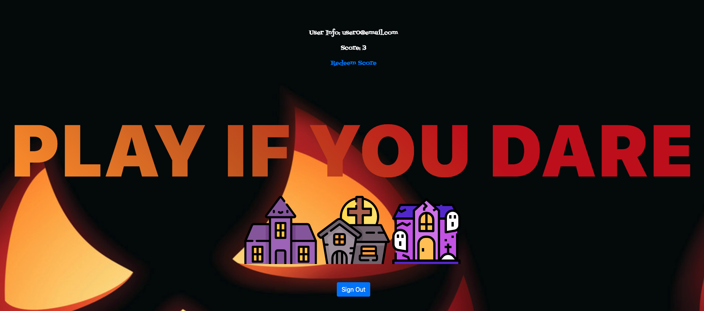
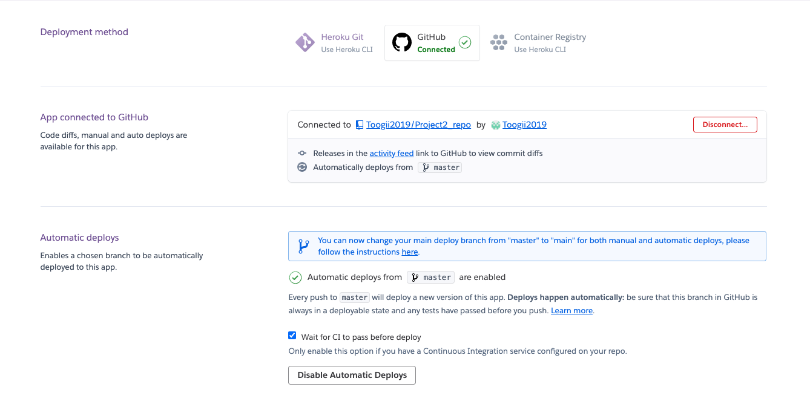
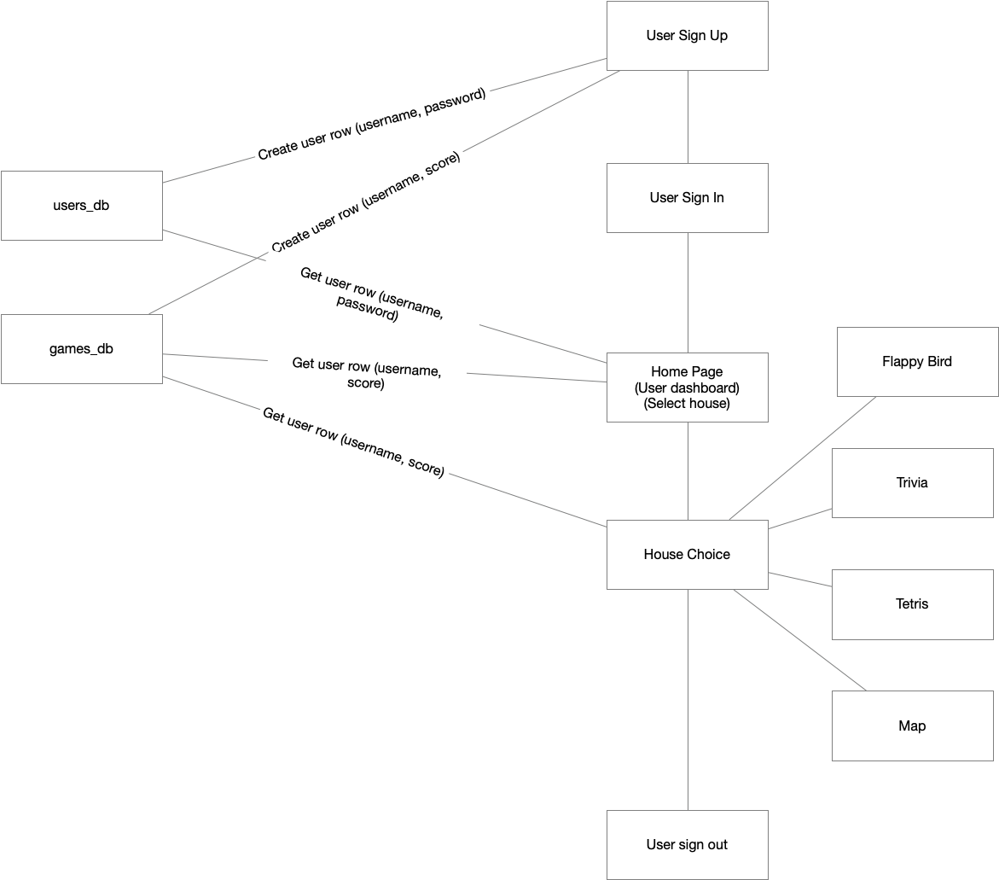

# trick_or_treat

### Team Members

| Front End:        | Back End:       |
| --------------    | -------------- |
| Gabriela Olivas   | Emay Lin |
| Ivey Lee          | Julee Butler   |
|                   | Toogii  |

# Paranormal Activity 13

Paranormal Activity 13 application will provide online interaction for the users to do Trick or Treating through the games that are on the applications. Users will be able to play games and sum up the scores to receive certificates to retrieve candy at certain participated stores. This application will aim to create safe environments for those who loves Trick or Treating on Halloween day online during the COVID-19/ social distancing era. 

## User Story

AS as person who wants to celebrate Halloween and trick or treat

I WANT TO interact with other people in contactless/ virtual setting

SO THAT I can enjoy Halloween in safe environment with social distancing 

## Screenshots of the Deployed Application 

## Table of Contents
  - [Installation](#installation)
  - [Usage](#usage)
  - [Tests](#tests)
  - [License](#license)

## Tools Used

* HTML
* CSS
* JavaScript
* JQuery
* Travis CI
* Node Packages
      -sequelize

      -mysql

      -util

      -handlebars

      -express

      -socket.io

## APIs and Github Sources

  -Tetris
  
  (Github repository forked from [Aerolab/blockrain.js](https://github.com/Aerolab/blockrain.js))

  -Flappy Bird
  
  (Github repository forked from [D4rk1n/JS-Flappy-Bird](https://github.com/D4rk1n/JS-Flappy-Bird))

  -Google Map
    
  -Trivia API
  
  (All data provided by the API is available under the Creative Commons Attribution-ShareAlike 4.0 International License.)

## Installation
  ​
npm install (to install all depencies for npm packages)

## User Criteria

GIVEN The glass is desktop or mobile,

​WHEN The user interacts with the app

​THEN The pages are responsive.

GIVEN The user lands on the page (Landing Page).

​WHEN User click for the haunted house,

​THEN Game for the selected haunted house will be displayed.

GIVEN The user views the game,

​WHEN User plays the game,

​THEN Score will go up or earn points.

WHEN User finish play the game,

THEN User will be able to create a personal profile to keep track of their completed task/game.

WHEN User has summed up points,

THEN Use will be able to swap points to candies in participating stores/ business

WHEN User click on the link for the location/map,

THEN Participating stores will show on the map.

## Develop

* Custom libraries at lib/
* Main code at server.js

## Contributing

Develop using project2_development branch and create pull request per change.

git clone --single-branch --branch project2_development git@github.com:Toogii2019/trick_or_treat.git

## License

This project is licensed under the MIT license.

## Credits

[Tetris Game](https://github.com/Aerolab/blockrain.js)

[Flappy-Bird](https://github.com/D4rk1n/JS-Flappy-Bird)

[Trivia](https://opentdb.com/api_config.php)

[Flaticon] (https://www.flaticon.com/)

Additional images were designed by Freepik, found on: [Freepik] (https://www.freepik.com)

## The URL of the deployed application / CD

1. Github repository and heroku are integrated
2. Changes in master branch triggers heroku deployment automatically
3. https://trick-or-treat-2020.herokuapp.com/

## The URL of the GitHub repository
https://github.com/Toogii2019/trick_or_treat

## Code Structure / core algorithm

